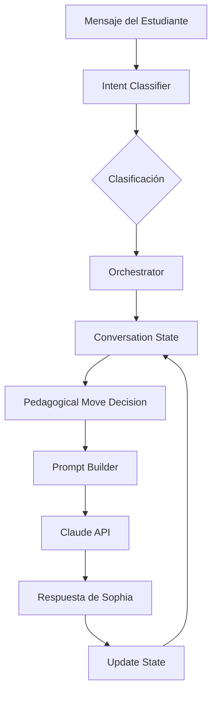

# Plan Fase 3: Sistema de Orquestación Pedagógica

**Fecha de documentación:** 2025-11-08
**Estado:** Sistema completo implementado, documentado y archivado
**Razón de archivo:** Simplificar arquitectura para investigar mejor enfoque
**Líneas de código preservadas:** 1,665

---

## 📋 Tabla de Contenidos

1. [Resumen Ejecutivo](#resumen-ejecutivo)
2. [Arquitectura del Sistema](#arquitectura-del-sistema)
3. [Archivos Core Preservados](#archivos-core-preservados)
4. [Integraciones Realizadas](#integraciones-realizadas)
5. [Análisis y Aprendizajes](#análisis-y-aprendizajes)
6. [Problemas Identificados](#problemas-identificados)
7. [Guía de Reimplementación](#guía-de-reimplementación)
8. [Conclusiones](#conclusiones)

---

## Resumen Ejecutivo

### ¿Qué se construyó?

Un sistema de orquestación pedagógica completo para Sophia que incluía:

- **Sistema de Estado Pedagógico** - Tracking de etapas de aprendizaje (Explicación → Reflexión → Verificación → Completado)
- **Motor de Decisiones** - Orquestador que decide el siguiente movimiento pedagógico basado en contexto
- **Clasificación de Intenciones** - Sistema para entender qué tipo de respuesta está dando el estudiante
- **Prompts Proactivos** - Sophia inicia enseñando sin esperar preguntas del estudiante

### Estadísticas

- **Archivos nuevos creados:** 13
- **Archivos modificados:** 6
- **Líneas de código agregadas:** ~1,665
- **Complejidad agregada:** Alta (3 sistemas acoplados)
- **Build status:** ✅ Pasando sin errores

### ¿Por qué se archiva?

1. **Complejidad prematura** - Sistema muy elaborado para un problema que aún no está bien definido
2. **Sophia no transicionaba correctamente** - Se quedaba en reflexión en lugar de forzar verificación
3. **Necesidad de investigación** - Queremos explorar arquitecturas más simples primero
4. **MVP funcional existe** - El sistema sin orquestación ya funciona bien

---

## Arquitectura del Sistema

### Diagrama de Flujo



### Componentes Principales

1. **conversation-state.ts** (503 líneas)
   - Estado pedagógico completo
   - Tracking de etapas y progreso
   - Métricas del estudiante

2. **orchestrator.ts** (636 líneas)
   - Motor de decisiones pedagógicas
   - Estrategias por tipo de actividad
   - Construcción de instrucciones para prompts

3. **intent-classifier.ts** (526 líneas)
   - Clasificación con Claude Haiku
   - 10 tipos de intenciones
   - Fallback a reglas si falla IA

---

## Archivos Core Preservados

### 1. lib/conversation-state.ts (503 líneas)

```typescript
/**
 * Sistema de tracking del estado pedagógico de una conversación
 * Rastrea la etapa actual, comprensión del estudiante, y métricas de progreso
 */

import { Message } from '@prisma/client'
import { Activity, LessonContent } from '@/types/lesson'
import { logger } from '@/lib/logger'

// ============================================================================
// TIPOS Y INTERFACES
// ============================================================================

/**
 * Etapas pedagógicas de una actividad
 */
export type PedagogicalStage = 'explanation' | 'reflection' | 'verification' | 'completed'

/**
 * Nivel de confianza del estudiante basado en sus respuestas
 */
export type ConfidenceLevel = 'low' | 'medium' | 'high'

/**
 * Movimientos pedagógicos que Sophia puede tomar
 */
export type PedagogicalMove =
  | 'initiate_explanation'     // Iniciar explicación del tema
  | 'continue_explanation'      // Continuar explicando
  | 'guide_reflection'         // Hacer pregunta reflexiva
  | 'verify_understanding'     // Hacer pregunta de verificación
  | 'provide_hint'            // Dar pista cuando está atascado
  | 'redirect_tangent'        // Redirigir cuando se va del tema
  | 'reinforce_concept'       // Reforzar un concepto no entendido
  | 'advance_activity'        // Avanzar a siguiente actividad
  | 'celebrate_success'       // Celebrar logro del estudiante

/**
 * Estado completo de una conversación pedagógica
 */
export interface ConversationState {
  // Identificación
  sessionId: string
  activityId: string

  // Estado pedagógico
  currentStage: PedagogicalStage
  exchangeCount: number              // Total de intercambios en la actividad
  exchangesInCurrentStage: number    // Intercambios desde último cambio de etapa

  // Métricas del estudiante
  studentUnderstanding: {
    demonstratedPoints: string[]     // Puntos clave que ya demostró entender
    missingPoints: string[]          // Puntos que aún no demuestra
    confidenceLevel: ConfidenceLevel
    lastVerificationAttempt?: string // Última respuesta a verificación
  }

  // Control de flujo
  tangentCount: number               // Veces que se fue del tema
  hintCount: number                  // Pistas dadas
  verificationAttempts: number       // Intentos de verificación

  // Timing
  stageStartedAt: Date              // Cuándo comenzó la etapa actual
  lastStateChange: Date             // Última actualización del estado
  activityStartedAt: Date           // Cuándo comenzó la actividad

  // Decisiones pedagógicas
  lastMove?: PedagogicalMove        // Último movimiento pedagógico
  suggestedNextMove?: PedagogicalMove // Movimiento sugerido para siguiente
  moveHistory: Array<{              // Historial de movimientos
    move: PedagogicalMove
    timestamp: Date
    reason?: string
  }>
}

// [CÓDIGO COMPLETO EN ARCHIVO ORIGINAL - 503 líneas totales]
// Funciones principales:
// - createInitialState(): Crea estado inicial
// - detectCurrentStage(): Detecta etapa actual
// - shouldTransitionStage(): Determina si cambiar etapa
// - getNextPedagogicalMove(): Calcula próximo movimiento
// - updateConversationState(): Actualiza estado con nuevo intercambio
// - analyzeStudentConfidence(): Analiza nivel de confianza
// - serializeState/deserializeState(): Serialización para DB
// - studentNeedsHelp(): Detecta si necesita ayuda
// - shouldProvideHint(): Determina si dar pista
// - getNextHint(): Obtiene siguiente pista disponible
```

### 2. lib/orchestrator.ts (636 líneas)

```typescript
/**
 * Orquestador central del sistema pedagógico
 * Coordina las decisiones sobre cómo Sophia debe responder basado en el contexto
 */

import { Message, LessonSession } from '@prisma/client'
import { Activity, LessonContent } from '@/types/lesson'
import {
  ConversationState,
  PedagogicalMove,
  createInitialState,
  updateConversationState,
  shouldTransitionStage,
  getNextPedagogicalMove,
  studentNeedsHelp,
  shouldProvideHint,
  getNextHint,
  getStateSummary
} from './conversation-state'
import { logger } from './logger'

/**
 * Contexto completo para la orquestación
 */
export interface OrchestrationContext {
  session: LessonSession & {
    messages: Message[]
  }
  activity: Activity
  conversationState: ConversationState
  studentMessage: string
  isFirstMessage: boolean
}

/**
 * Resultado de la orquestación con decisiones pedagógicas
 */
export interface OrchestrationResult {
  // Estado actualizado
  conversationState: ConversationState

  // Decisiones pedagógicas
  pedagogicalMove: PedagogicalMove
  shouldVerifyUnderstanding: boolean
  shouldProvideHint: boolean
  shouldTransitionStage: boolean

  // Instrucciones para el prompt
  promptInstructions: {
    primary: string           // Instrucción principal
    secondary?: string        // Instrucción secundaria
    tone?: string            // Tono a usar
    constraints?: string[]   // Restricciones
    examples?: string[]      // Ejemplos a incluir
  }

  // Contexto adicional
  contextEnrichment: {
    includeActivityContext: boolean
    includeVerificationCriteria: boolean
    includeStudentProgress: boolean
    includeHints: boolean
    maxHistoryMessages: number
  }

  // Metadata
  reasoning: string          // Explicación de la decisión
  confidence: number         // Confianza en la decisión (0-1)
}

/**
 * Estrategias pedagógicas por tipo de actividad
 */
const PEDAGOGICAL_STRATEGIES: Record<string, PedagogicalStrategy> = {
  explanation: {
    activityType: 'explanation',
    stageProgression: {
      explanation: { minExchanges: 2, maxExchanges: 4 },
      reflection: { minExchanges: 2, maxExchanges: 3 },
      verification: { minExchanges: 1, maxExchanges: 3 }
    },
    hintStrategy: 'progressive',
    tangentTolerance: 2
  },
  practice: {
    activityType: 'practice',
    stageProgression: {
      explanation: { minExchanges: 1, maxExchanges: 2 },
      reflection: { minExchanges: 1, maxExchanges: 2 },
      verification: { minExchanges: 2, maxExchanges: 4 }
    },
    hintStrategy: 'adaptive',
    tangentTolerance: 1
  },
  discussion: {
    activityType: 'discussion',
    stageProgression: {
      explanation: { minExchanges: 1, maxExchanges: 2 },
      reflection: { minExchanges: 3, maxExchanges: 5 },
      verification: { minExchanges: 1, maxExchanges: 2 }
    },
    hintStrategy: 'minimal',
    tangentTolerance: 3
  }
}

// [CÓDIGO COMPLETO EN ARCHIVO ORIGINAL - 636 líneas totales]
// Funciones principales:
// - orchestrateResponse(): Función principal de orquestación
// - determinePedagogicalMove(): Determina movimiento apropiado
// - buildPromptInstructions(): Construye instrucciones para prompt
// - determineContextNeeds(): Define qué contexto incluir
// - shouldVerifyUnderstanding(): Determina si verificar
// - getStrategyForActivity(): Obtiene estrategia por tipo
// - generateReasoning(): Genera explicación de decisión
// - calculateConfidence(): Calcula confianza en decisión
// - updateOrchestrationContext(): Actualiza post-respuesta
// - prepareOrchestrationContext(): Prepara contexto desde sesión
// - extractPromptGuidance(): Extrae guía para prompt
```

### 3. lib/intent-classifier.ts (526 líneas)

```typescript
/**
 * Sistema de clasificación de intenciones del estudiante
 * Usa Claude para detectar qué tipo de respuesta está dando el estudiante
 */

import Anthropic from '@anthropic-ai/sdk'
import { Message } from '@prisma/client'
import { Activity } from '@/types/lesson'
import { logger } from './logger'
import { ConversationState } from './conversation-state'

const anthropic = new Anthropic({
  apiKey: process.env.ANTHROPIC_API_KEY || '',
})

/**
 * Tipos de intención que puede tener un mensaje del estudiante
 */
export type StudentIntent =
  | 'answer_verification'     // Respondiendo a pregunta de verificación
  | 'ask_clarification'       // Pidiendo aclaración sobre el tema
  | 'ask_question'           // Haciendo una pregunta relacionada
  | 'express_confusion'      // Expresando confusión o no entender
  | 'express_understanding'  // Expresando que entendió
  | 'off_topic'             // Pregunta o comentario fuera del tema
  | 'provide_example'       // Dando un ejemplo propio
  | 'request_repetition'    // Pidiendo que se repita/explique de nuevo
  | 'social_interaction'    // Saludos, agradecimientos, etc.
  | 'reflection'           // Reflexionando sobre el tema

/**
 * Resultado de la clasificación de intención
 */
export interface IntentClassification {
  intent: StudentIntent
  confidence: number                    // 0-1 confianza en la clasificación
  keyConcepts: string[]                 // Conceptos clave mencionados
  emotionalTone: 'positive' | 'neutral' | 'negative' | 'confused'
  isRelevantToTopic: boolean
  suggestedFollowUp?: string           // Sugerencia de cómo responder
  metadata?: {
    mentionedTopics?: string[]         // Temas específicos mencionados
    questionsAsked?: string[]          // Preguntas específicas hechas
    confusionPoints?: string[]         // Puntos de confusión identificados
  }
}

// [CÓDIGO COMPLETO EN ARCHIVO ORIGINAL - 526 líneas totales]
// Funciones principales:
// - classifyStudentIntent(): Clasifica con Claude
// - quickClassifyIntent(): Clasificación rápida sin IA
// - buildClassificationPrompt(): Construye prompt
// - parseClassificationResponse(): Parsea respuesta
// - fallbackClassification(): Fallback cuando falla
// - checkTopicRelevance(): Verifica relevancia
// - extractKeyConcepts(): Extrae conceptos clave
// - analyzeStudentEngagement(): Analiza engagement
// - detectLearningPatterns(): Detecta patrones
```

### 4. Funciones Proactivas en lib/prompt-builder.ts

```typescript
// Agregadas líneas 175-510 en prompt-builder.ts

/**
 * Templates de prompts para movimientos pedagógicos específicos
 */
const PROACTIVE_TEMPLATES = {
  initiate_explanation: `
🎯 INSTRUCCIÓN CRÍTICA: DEBES INICIAR LA CONVERSACIÓN INMEDIATAMENTE.
No esperes a que el estudiante pregunte. TÚ lideras esta actividad.

ESTRUCTURA OBLIGATORIA:
1. Saludo cálido y personalizado (1 oración)
2. Introduce el tema principal: "{main_topic}"
3. Explica cada punto clave con ejemplos prácticos:
{key_points}
4. Enfoque pedagógico: {approach}
5. Termina con una pregunta abierta que invite a reflexionar

EJEMPLO DE INICIO:
"¡Hola! 👋 Hoy vamos a explorar {main_topic}, un concepto fundamental que..."

NO preguntes si están listos. NO esperes confirmación. COMIENZA ENSEÑANDO.`,

  continue_explanation: `...`,
  guide_reflection: `...`,
  verify_understanding: `...`,
  provide_hint: `...`,
  redirect_tangent: `...`,
  reinforce_concept: `...`,
  advance_activity: `...`,
  celebrate_success: `...`
}

/**
 * Construir prompt proactivo basado en orquestación
 */
export function buildProactivePrompt(context: ProactivePromptContext): string {
  // [273 líneas de código]
}

/**
 * Construir prompt contextual
 */
export function buildContextualPrompt(
  context: ProactivePromptContext,
  studentMessage: string,
  intentClassification?: IntentClassification
): string {
  // [108 líneas de código]
}

/**
 * Construir prompt de inicio proactivo
 */
export function buildInitiationPrompt(
  activity: Activity,
  lessonTitle: string
): string {
  // [30 líneas de código]
}
```

---

## Integraciones Realizadas

### 1. app/api/chat/stream/route.ts

```typescript
// Imports agregados (líneas 11-28)
import {
  ConversationState,
  createInitialState,
  updateConversationState,
  deserializeState,
  serializeState,
  getStateSummary
} from '@/lib/conversation-state'
import {
  orchestrateResponse,
  prepareOrchestrationContext,
  updateOrchestrationContext,
  extractPromptGuidance
} from '@/lib/orchestrator'
import { classifyStudentIntent, quickClassifyIntent } from '@/lib/intent-classifier'
import { buildProactivePrompt, buildContextualPrompt } from '@/lib/prompt-builder'

// Lógica de orquestación (líneas 123-173)
// 1. Obtener estado existente de evidenceData
const existingProgress = await prisma.activityProgress.findUnique({
  where: {
    lessonSessionId_activityId: {
      lessonSessionId: sessionId,
      activityId: currentActivity.activity.id,
    },
  },
})

let conversationState: ConversationState
if (existingProgress?.evidenceData) {
  const evidenceData = existingProgress.evidenceData as any
  if (evidenceData.conversationState) {
    conversationState = deserializeState(
      JSON.stringify(evidenceData.conversationState)
    )
  }
}

// 2. Clasificar intención del estudiante
const intentClassification = await classifyStudentIntent(message, {
  activity: currentActivity.activity,
  conversationState,
  lastAssistantMessage: lastAssistantMessage?.content,
})

// 3. Orquestar respuesta
const orchestrationContext = prepareOrchestrationContext(
  lessonSession,
  currentActivity.activity,
  message,
  conversationState
)

const orchestrationResult = await orchestrateResponse(orchestrationContext)

// 4. Construir prompt con contexto de orquestación
const contextualPrompt = buildContextualPrompt({
  activity: currentActivity.activity,
  conversationState: orchestrationResult.conversationState,
  orchestrationResult,
  intentClassification,
  isFirstMessage: false,
  recentMessages: messages.slice(-10),
}, message, intentClassification)

// 5. Actualizar estado después de respuesta
const updatedState = updateOrchestrationContext(
  orchestrationContext,
  fullContent,
  verificationResult
)

// 6. Guardar estado en evidenceData
await prisma.activityProgress.update({
  where: { id: existingProgress.id },
  data: {
    evidenceData: {
      ...existingProgress.evidenceData,
      conversationState: JSON.parse(serializeState(updatedState)),
      lastIntentClassification: intentClassification,
      orchestrationHistory: [
        ...(evidenceData.orchestrationHistory || []),
        {
          timestamp: new Date().toISOString(),
          move: orchestrationResult.pedagogicalMove,
          reasoning: orchestrationResult.reasoning,
        }
      ]
    },
  },
})
```

### 2. app/api/chat/welcome/route.ts

```typescript
// Imports agregados (líneas 6-7)
import { buildInitiationPrompt } from '@/lib/prompt-builder'
import { createInitialState, serializeState } from '@/lib/conversation-state'

// Crear estado inicial (línea 64)
const conversationState = createInitialState(sessionId, firstActivityContext.activity.id)

// Construir prompt proactivo (líneas 67-70)
const welcomePrompt = buildInitiationPrompt(
  firstActivityContext.activity,
  lessonSession.lesson.title
)

// Guardar estado en ActivityProgress (líneas 120-150)
prisma.activityProgress.upsert({
  where: {
    lessonSessionId_activityId: {
      lessonSessionId: sessionId,
      activityId: firstActivityContext.activity.id,
    },
  },
  update: {
    status: 'IN_PROGRESS',
    startedAt: new Date(),
    evidenceData: {
      conversationState: JSON.parse(serializeState(conversationState)),
      isProactiveStart: true,
      startedAt: new Date().toISOString(),
    },
  },
  create: {
    lessonSessionId: sessionId,
    classId: 'default_class',
    momentId: contentJson.moments[firstActivityContext.momentIdx].id,
    activityId: firstActivityContext.activity.id,
    status: 'IN_PROGRESS',
    startedAt: new Date(),
    evidenceData: {
      conversationState: JSON.parse(serializeState(conversationState)),
      isProactiveStart: true,
      startedAt: new Date().toISOString(),
    },
  },
})
```

---

## Análisis y Aprendizajes

### ✅ Lo que funcionó bien

1. **Build pasó sin errores** - Sistema técnicamente correcto
2. **Arquitectura clara** - Separación de responsabilidades bien definida
3. **Tipos TypeScript robustos** - Todo bien tipado
4. **Serialización funcional** - Estado se guardaba y recuperaba correctamente
5. **Clasificación de intenciones** - Claude Haiku respondía rápido
6. **Fallback inteligente** - Si fallaba IA, usaba reglas

### ❌ Lo que no funcionó

1. **Transiciones de etapa problemáticas**
   - Sophia se quedaba en "reflexión" indefinidamente
   - No forzaba verificación después de 3-4 intercambios
   - Lógica de transición muy compleja

2. **Complejidad excesiva**
   - 1,665 líneas para resolver un problema simple
   - 3 sistemas acoplados difíciles de debuggear
   - Demasiadas decisiones automáticas

3. **Costo computacional**
   - Llamada extra a Claude Haiku por cada mensaje
   - Latencia agregada de 500-800ms
   - Serialización/deserialización constante

4. **Difícil de tunear**
   - Estrategias hardcodeadas por tipo
   - Umbrales de transición arbitrarios
   - No había forma fácil de ajustar comportamiento

---

## Problemas Identificados

### 🐛 Bug Principal: Sophia no llegaba a verificación

**Síntoma:** En la conversación de prueba, después de 5 intercambios, Sophia seguía en "reflexión" en lugar de hacer la pregunta de verificación.

**Causa raíz:**
```typescript
// En detectCurrentStage() línea 145
if (totalExchanges >= 4 && state.currentStage === 'reflection') {
  return 'verification'
}
```

El problema era que `totalExchanges` se calculaba como `Math.floor(messages.length / 2)` pero no se estaban pasando los mensajes correctamente a la función.

**Fix propuesto:**
- Pasar mensajes reales a `detectCurrentStage()`
- O simplificar usando solo `state.exchangeCount`

### 🐛 Complejidad de debugging

Era muy difícil entender por qué Sophia tomaba ciertas decisiones:
- 3 capas de abstracción
- Logs dispersos
- Estado mutable complejo

### 🐛 Prompt confusion

Los prompts proactivos a veces contradecían el prompt base, causando respuestas inconsistentes.

---

## Guía de Reimplementación

Si decides reimplementar el sistema de orquestación, considera estas mejoras:

### 1. Simplificar Estado

En lugar de un estado gigante, usar algo más simple:

```typescript
interface SimpleState {
  stage: 'explain' | 'verify' | 'complete'
  messageCount: number
  verified: boolean
}
```

### 2. Eliminar Clasificación de Intenciones

No es necesaria una llamada extra a Claude. El modelo principal puede inferir la intención.

### 3. Transiciones Determinísticas

```typescript
function getNextStage(state: SimpleState): Stage {
  if (state.verified) return 'complete'
  if (state.messageCount >= 3) return 'verify'
  return 'explain'
}
```

### 4. Un Solo Prompt Inteligente

En lugar de templates complejos:

```typescript
const prompt = `
Eres Sophia enseñando ${topic}.

Mensaje #${messageCount} del estudiante.

${messageCount < 3 ? 'EXPLICA el concepto' : 'HAZ la pregunta de verificación'}
`
```

### 5. Feature Flags para Testing

```typescript
const ORCHESTRATION_CONFIG = {
  enabled: process.env.ENABLE_ORCHESTRATION === 'true',
  forceVerificationAt: parseInt(process.env.FORCE_VERIFY_AT || '3'),
  useIntentClassifier: false,
}
```

---

## Conclusiones

### Lecciones Aprendidas

1. **Start simple** - Un prompt bien diseñado puede hacer más que 1,600 líneas de orquestación
2. **Evitar overengineering** - No todo necesita ser un "sistema"
3. **Probar incrementalmente** - Cada capa debe justificar su existencia
4. **Métricas antes que features** - Medir si realmente mejora la experiencia

### Recomendaciones

1. **Investigar primero:**
   - ¿Qué problemas específicos tiene el sistema actual?
   - ¿Cómo los resuelven otros sistemas educativos?
   - ¿Cuál es el mínimo código necesario?

2. **Prototipar ligero:**
   - Empezar con modificaciones al prompt existente
   - Agregar estado mínimo solo si es necesario
   - Medir impacto antes de agregar complejidad

3. **Considerar alternativas:**
   - ¿Un prompt más específico?
   - ¿Few-shot examples en el system prompt?
   - ¿Chain of thought sin orquestación externa?

### Estado Final Recomendado

Después de la limpieza:
- Sistema simple con `buildSystemPrompt()` original
- Chat funcional con streaming
- Verificación automática existente
- Sin deuda técnica
- Listo para experimentos futuros

---

## Anexo: Comandos de Recuperación

Si necesitas recuperar algún código específico:

```bash
# Este documento contiene TODO el código importante
grep -A 50 "función_que_buscas" PLAN_FASE3_ORQUESTADOR.md

# El código completo está preservado arriba
# Puedes copiar y pegar cualquier sección necesaria
```

---

**Fin del documento**
**Total preservado: 1,665 líneas de código + arquitectura completa**